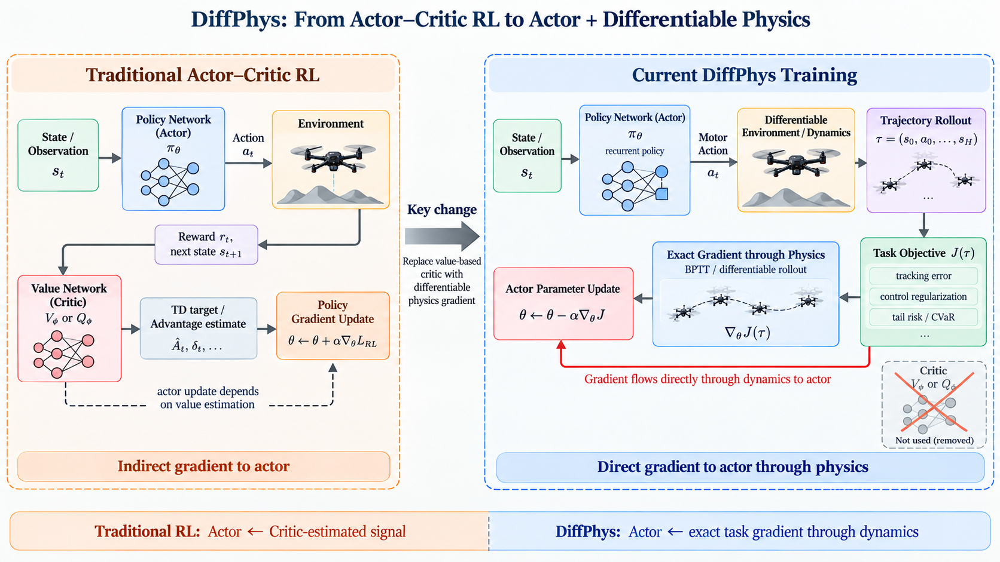

# DiffPhys response motor control

A single GRU and direct-state linear readout learn from differentiable
quadrotor flight. The Actor consumes 22 deployable observation entries and outputs
four **absolute normalized motor commands** in [-1,1]. No mass, inertia, motor
state or external-force truth is given to the Actor.

## GRU16 direct-readout architecture

This branch changes only the Actor architecture and necessary state/checkpoint
interfaces from `codex/time-decay-bounded-influence-20260925@ea5a8f2`.

```text
22D observation -> existing frame/scaling -> c_t (16D)
                                             | \
                    h_(t-1) -> GRU(16,64) <---+  \
                                  |               \
                            h_t (64D) ------------ concat(c_t,h_t)
                                  |                       |
                             next step              Linear(80,4)
                                                          |
                                                        tanh
                                                          |
                                                 4 absolute motors
```

`h_t = GRU(c_t,h_(t-1))`; `a_t = tanh(W_c c_t + W_h h_t + b)`.
The single readout contains `[W_c | W_h]`. W_c starts at zero; W_h is small
and nonzero. All blocks train together with the original group-gradient
normalization and one Adam update. Hidden updates on the first observation;
there is no external encoder, MLP, explicit integral or response-history cache.
Default parameter count: **16,068**. See [architecture and migration details](docs/gru16_direct_readout.md).

**New architecture, new training run:** old response-encoder/MLP v3 checkpoints
cannot initialize, resume or evaluate this Actor. Only matching GRU16 checkpoints
are supported. Do not overwrite old work directories or edit checkpoint hashes.
Physics, losses, Time Decay, group averaging and optimizer settings are retained;
this is not a claim of equal flight trajectories or faster learned convergence.

## Learning approach

DiffPhys trains the Actor by differentiating the physical task objective through
the simulated dynamics and recurrent policy. The comparison below shows how this
direct gradient path replaces the learned Critic used in Actor-Critic training;
the current DiffPhys pipeline has no value network.



*Figure 1. From Critic-based policy updates to direct task gradients through
differentiable quadrotor dynamics.*

## Reference environment v3

The production path now uses two explicit reference protocols:

| `--scenario-mode` | Environment and initialization |
| --- | --- |
| `l2f` | 2024 L2F Crazyflie, original quadratic RPM thrust curve, 150 ms motor response, source observation noise/force/torque, position +/-0.2 m inside +/-0.6 m boundaries |
| `raptor` (default) | RAPTOR source joint dynamics distribution, **paper-first** 90-degree initialization, per-axis position +/-10 rotor radii and termination +/-20 radii, speed/omega initialization +/-1, source force/noise settings |

Both use FLU X geometry, motor order **front-right, back-right, back-left,
front-left**, 100 Hz and joint RK4 dynamics. Motor zero is no longer a universal
hover point. A command maps by `u = min + (action+1)/2*(max-min)`; motor lag acts
on `u` and the original thrust polynomial acts on that delayed state. The
RAPTOR profile samples rising/falling delays independently. The default Actor
has no extra slew-rate projection (`--action-rate 0`).

**Breaking change:** v2 and older hover-centered / plus-layout checkpoints cannot
be resumed, used for weight initialization or evaluated under v3. Retrain in a
new work directory. Editing checkpoint hashes is not a migration. Removed
`fixed-airframe` / `physical-fit` CLI names fail explicitly instead of silently
changing the meaning of old commands.

The definitive numerical settings, source pins, initialization discrepancies and
limits of this comparison are in [the reference protocol](docs/raptor_reference.md).
`docs/response_control_v1.md` describes the **pre-v3** environment and its migration
path; it is historical, not the current motor/scene contract.

## Production path

The eight production files are `env_l2f.py`, `response_policy.py`,
`response_task.py`, `response_adjoints.py`, `response_training.py`,
`response_groups.py`, `response_execution.py` and `tools/train_response_control.py`.

The current Actor is the GRU16 graph above. The previous
[response-encoder architecture image](docs/images/Diffphys_Architecture.png)
is retained as a historical illustration, not the current network specification.

The inherited [physical-group update](docs/physics_group_balance.md) is unchanged:
whole-Actor gradients are normalized by group and averaged before a single Adam
step. `configs/response_raptor_multi_airframe.args` enables this path; the CLI
switch default remains off. Group balancing requires full BPTT and AGC off.

Termination is **position-only**, with strict per-axis boundary exceedance;
velocity and angular velocity remain costs, not episode termination triggers.

Each aircraft stops at its first boundary violation or the horizon cap (default
500). The crossing transition is retained; other aircraft continue independently.
Stopped rows are not passed to Actor or RK4 again and are not reset/replaced.
`full` retains every executed transition. `windowed` recomputes windows in
reverse with boundary covectors, reproducing the same configured backward rule. Each
scene's observation noise is pre-sampled once, held fixed for that rollout and
reused during recomputation. Immutable noise tapes are shared across snapshots.
Both modes keep finite checks, optional AGC, global clipping, atomic checkpoints,
RNG restoration and persistent Adam. The old implicit angular solver is replaced
by reference RK4; there are no implicit-solve status checks to defer.

New training defaults to `--time-decay 1`: at every 10 ms control step, incoming
physical and recurrent-state gradients are multiplied by `exp(-1*0.01)`.
Forward states, actions, GRU memory values, termination, loss and CVaR scores
are unchanged. This is a **surrogate gradient**, not exact H500 BPTT or physical
damping. H50 boundaries apply no additional decay; both backprop modes implement
the same rule. Use `--time-decay 0` for the earlier exact derivative. The rate is
in seconds^-1, recorded in training logs and checkpoint binding; changing it
is not exact resume. Existing compatible GRU16 weights may initialize a new run
with fresh Adam via `--init-checkpoint`. The deployed Actor has no new parameters.
This is an independently implemented full-state adaptation of temporal gradient
decay from Zhang et al., *Learning vision-based agile flight via differentiable
physics* (NMI 2025; DOI `10.1038/s42256-025-01048-0`), not a reproduction of its
controller. The source `HenryHuYu/DiffPhysDrone@2719361` damps selected physics
paths; this implementation also covers the recurrent/history paths.

`--scenarios` is per TRAIN bank (four banks); `--eval-scenarios` is per fixed EVAL
bank (two banks) and is independent of TRAIN batch size. Defaults are 512 TRAIN
and 256 EVAL trajectories, seed 7, H500, lr=3e-4, gradient scale 0.1 and clip 10.
Periodic evaluation/checkpoint cadence remains 50 updates. Checkpoints bind the
protocol, environment source hash, action convention and sampling configuration.
Only compatible GRU16 checkpoints can be rescored with newer metric code.

New runs default to `--dead-cost 3 --terminal-cost 200` (raw units, divided
by H exactly once). The values are bound in checkpoint loss configuration and
`loss_config` in EVAL reports. Set both to zero for the earlier accounting.
Matching-architecture checkpoints without these fields keep zero failure costs on evaluation;
strict resume still rejects source/objective changes. Start a new run and use
compatible weights-only initialization when explicitly changing the objective.

The production trainer updates only the Actor. The stability Metric MLP,
auxiliary contraction loss and its optimizer have been removed. Both launch
configs retain their original Time Decay and output-path settings. Override
`--work-dir` for this architecture. Only matching GRU16 Actor checkpoints can
be evaluated or used for weights-only initialization; irrelevant auxiliary
network payloads remain ignored. Source changes prevent exact resume.
Time Decay does not guarantee bounded gradients or stable flight.

## Run

Python, PyTorch and NumPy are required; no native extension is needed. Launch
training only with an explicit time/update budget:

```bash
# Multi-airframe, paper-first initialization
python3 tools/train_response_control.py $(cat configs/response_raptor_multi_airframe.args) \
  --work-dir runs/gru16_direct_readout/seed7

# Single-airframe L2F with Time Decay
python3 tools/train_response_control.py $(cat configs/response_phase1_single_airframe.args) \
  --work-dir runs/gru16_direct_readout_l2f/seed7
```

`--mode profile` executes at most one update. Use `--mode evaluate --checkpoint
PATH --work-dir NEW_DIR` to evaluate a matching GRU16 checkpoint; it uses the checkpoint's
protocol, horizon and fixed EVAL count, not unrelated CLI defaults.

Bounded verification (no long training or external downloads):

```bash
OMP_NUM_THREADS=1 python3 -m pytest tests -q
```

## Scope and provenance

The reference profiles define scene, sensor/disturbance and motor semantics.
Temporal decay changes the training gradient, not the forward task. The
GRU16 Actor replaces the response-encoder/MLP architecture; existing
Huber/CVaR terms and weights remain. Only post-termination padding is excluded
from costs and statistics; horizon normalization and the original steady window
are unchanged. Failure accounting adds `d * (3*(H-X) + 200) / H` to each
scene, once at its first crossing and before pooled CVaR selection. Here `X`
includes the crossing transition, and `d` is false for a clean horizon timeout.
At H=500, failure at X=19 adds 3.286; failure at X=500 adds 0.4. No dead-state
physics, extra steady-window weighting, barrier or Critic is added. These
constants change scores/CVaR selection, not the derivative of the discrete
failure event. They do not guarantee that every failure scores worse than every
survivor. Reference metrics retain the **first** failure and publish
only the matching profile. We do not reproduce RAPTOR's teachers, distillation, reward,
Langevin trajectory curriculum or seven-airframe published evaluation set. Fresh
TRAIN episodes sample the same source distribution, not a byte-identical copy of
the original 1000-airframe archive. Therefore these are reference-environment
changes, not a claim of reproducing the full RAPTOR experiment or its performance.

Historical source/provenance and `物理配置/` remain available. Earlier baselines
and diagnostic code remain at `76b3a02857e122fbfdef5ece5d0ae7dbf98a870b`.
See [third-party notices](THIRD_PARTY_NOTICES.md). No new license is asserted for
the whole repository. Exact gradients can still explode over long horizons.
Passing numerical tests does not prove hover/adaptation or authorize real flight.
